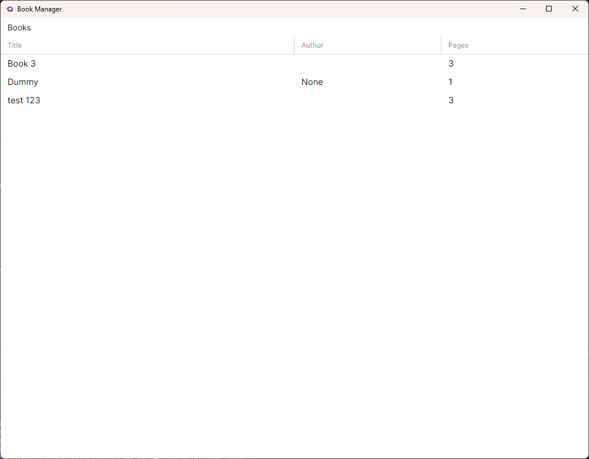
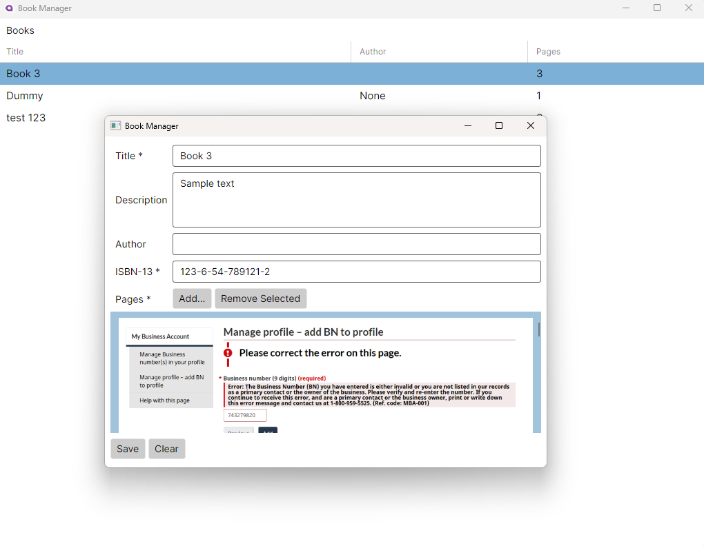

# Book Manager
This is a demonstration book manager cross platform application created with Avalonia and .NET 9. Application has a home window which shows the list of saved books. Each book's metadata is saved in JSON format inside data directory which is inside 'Documents' directory for the user. Application also has a popup window to add new books and edit existing, the popup allows user to pick book page images. Image paths are stored with book metadata inside JSON. Loading indicator is shown for long running actions.

Screenshot shows main application screen.

Screenshot shows popup window for adding and editing book metadata with page images.

# Tools/Technologies Used
* Visual Studio Community 2022
* Avalonia v11
* .NET Framework 9
* Windows 11

# Concepts Demonstrated
* Model Validation
* MVVM Pattern
* Dependency Injection
* File System Handling
* JSON parsing
* Separation of Concerns (use of service injected via DI)

# Assumptions
* Exception handling is not done rigidly due to shortage of time.
* Testing on MacOS not done due to unavailibility of hardware.

# Build Steps
1. Clone the repository on your local computer.
2. Open 'AvaloniaDemonstration.sln' in Visual Studio 2022.
3. Set 'AvaloniaDemonstration.Desktop" project as stratup project.
4. Hit F5 to build and run the application.

I created cross platform file manager application a few years back using Avalonia. Check it out here [Jaya File Manager](https://github.com/waliarubal/Jaya).
